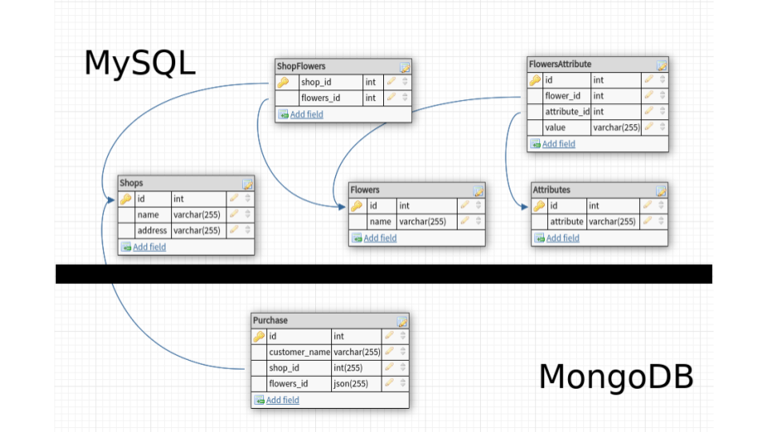

# GraphQL Example Project

Проект представляет собой пример реализации GraphQL API с использованием фреймворка Symfony 5 и библиотеки 
GraphQLBundle (вендор Overblog). Проект состоит из четырех Docker контейнеров (php, mysql, nginx, mongodb).

## Установка и развертывание приложения
1. Клонируем репозиторий:

    `git@github.com:Pruanik/graphql_example_project.git`

2. Собираем контейнеры:

    `make build`

3. Запуск контейнеров

   `make up`

4. Настраиваем .env файл:

   `cp .env_example .env`

5. Устанавливаем зависимости:

   `make composer-install`

6. Разворачиваем миграции и заливаем фикстуры:

    `make init`

7. Смотрим результат: 

   [http://localhost:8080/](http://localhost:8080/)

## Список команд для управления проектом
**Для сборки контейнеров:**
`make build`

**Для установки всех composer зависимостей:**
`make composer-install`

**Для запуска контейнеров:**
`make up`

**Для запуска контейнеров приложения, если базы у Вас расположены локально:**
`up-without-databases`

**Для разворачивания миграции и заливания фикстур:**
`make init`

**Для остановки контейнеров:**
`make stop`

**Для входа в главный контейнер с приложением:**
`make enter`

## Полезные ссылки
* По умолчанию проект разворачивается на порту 8080, а значит ссылка будет 
[http://localhost:8080/](http://localhost:8080/) 
* В проект подключена библиотека overblog/graphiql-bundle для удобства тестирования запросов к GraphQL серверу. 
Для того чтобы воспользоваться ее интерактивным режимом необходимо перейти по ссылке: 
[http://localhost:8080/graphiql](http://localhost:8080/graphiql)
* Для обращения к развернутому GraphQL серверу при помощи клиента (например Postman), необходимо посылать запросы 
на адрес: [http://localhost:8080/graphql/](http://localhost:8080/graphql/)

## Схема модели данных приложения

## Структура приложения

* Схема GraphQL данных хранятся в *config/graphql/types/Domain/Input* и *config/graphql/types/Domain/Object* для мутаций
и объектов соответственно.
* В папке *migration* актуальные миграции для развертывания приложения.
* В папках *src/Document* и *src/Entity* описаны все сущности для MongoDb и Mysql соответственно.
* В папке *src/GraphQL* находятся все пользовательские классы для выстраивания логики работы GraphQL с нашим Symfony 
приложением.
* *src/Listener/ReferencesListener.php* - необходим для настройки релейшен связей между сущностями хранящимися в mysql и 
сущностями в MongoDb.
* В папке *src/Model* лежат все классы нашего Symfony приложения.
* *src/Security/ApiTokenAuthenticator.php* - тут реализован кастомный способ аутентификации пользователя по наличию 
ключа в заголовке запроса.
